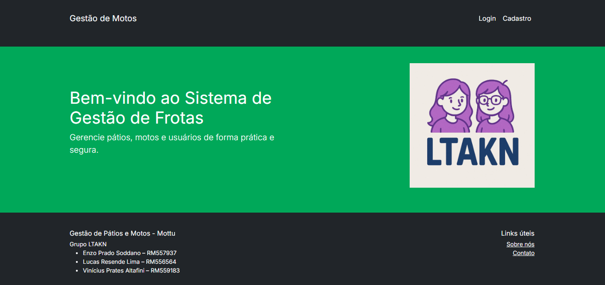
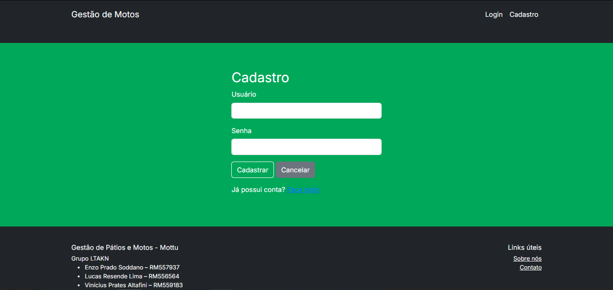
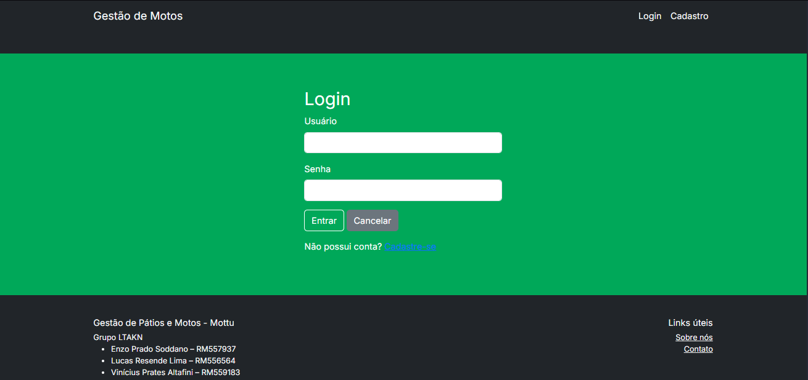
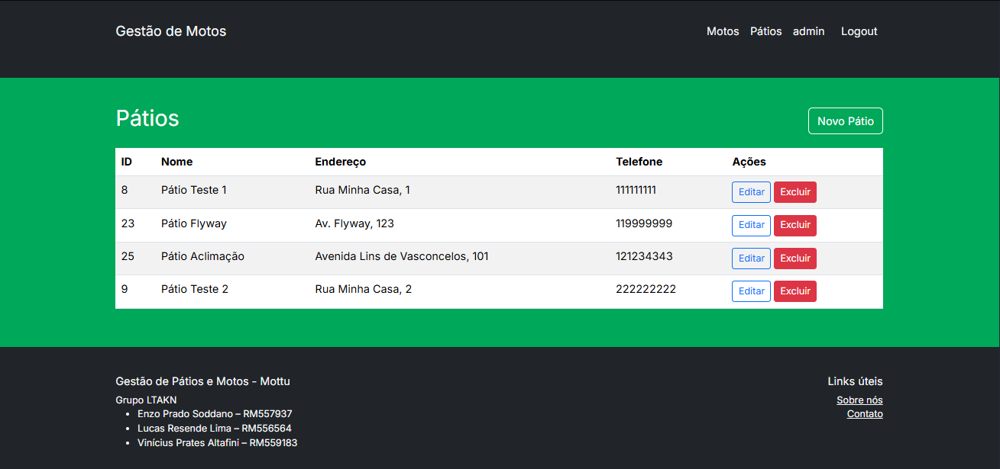
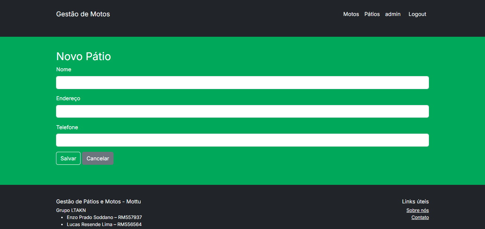
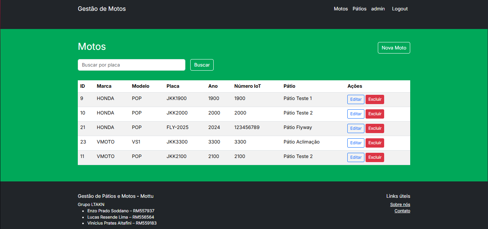
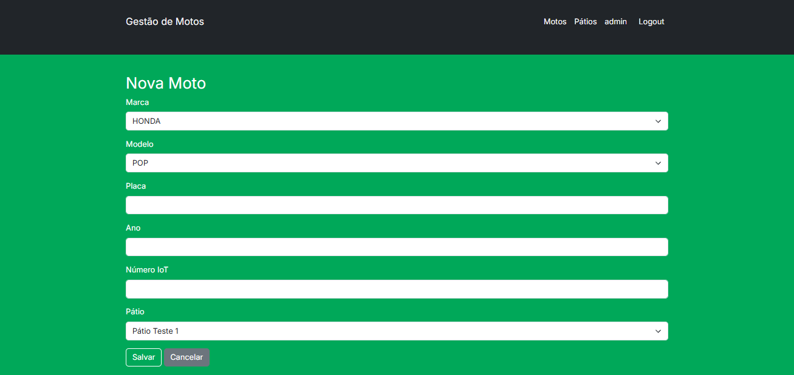

# Gestão de Frota - Challenge Java 2025 Sprint 3

**Grupo:** LTAKN
* Enzo Prado Soddano — RM557937
* Lucas Resende Lima — RM556564
* Vinícius Prates Altafini — RM559183


---

## 📌 Descrição

Este projeto contém a terceira sprint do **Challenge 2025** da disciplina de Java Advanced. Consiste em uma aplicação de **Gestão de Frota** que permite gerenciar motos, pátios e usuários. A aplicação foi desenvolvida com foco em boas práticas, segurança e deploy automatizado na nuvem.

O projeto utiliza:
* Interface web com **Spring MVC + Thymeleaf**.
* CRUD completo para as principais entidades do sistema.
* Segurança com **Spring Security** para controle de acesso e autenticação.
* Persistência com **Spring Data JPA** conectado a um banco de dados **Azure SQL**.
* Migrations automatizadas com **Flyway** para controle de versão do schema do banco de dados.
* Deploy automatizado (CI/CD) com **GitHub Actions** para o **Azure App Service**.

---

## 🛠️ Tecnologias

* **Java 21**
* **Spring Boot 3**
* Spring MVC + Thymeleaf
* Spring Data JPA
* Spring Security
* **Flyway**
* Maven
* **Azure SQL** (Banco de Dados em Nuvem)
* **Azure App Service** (Hospedagem em Nuvem)
* **GitHub Actions** (CI/CD)
* Bootstrap + CSS customizado
* Lombok

---

## ☁️ Deploy e Acesso em Nuvem

A aplicação está publicada no Azure e pode ser acessada através da seguinte URL:

**[webapp-challenge-945-sprint3.azurewebsites.net)**

O deploy é feito automaticamente a cada `push` para a branch `main` via GitHub Actions.

#### 👤 Usuários para Teste
* **Usuário:** `user`, **Senha:** `userpass` (Acesso padrão)
* **Usuário:** `admin`, **Senha:** `adminpass` (Acesso de administrador)

---

## ⚙️ Como Rodar Localmente

#### Pré-requisitos
* Java 21 (JDK)
* Maven 3.x
* IntelliJ IDEA ou outra IDE de sua preferência

#### Passos
1.  **Clone o repositório:**
    ```bash
    git clone [https://github.com/vinicius945/Challenge_Java_2025_Sprint3.git](https://github.com/vinicius945/Challenge_Java_2025_Sprint3.git)
    cd Challenge_Java_2025_Sprint3
    ```

2.  **Abra o projeto** na sua IDE e aguarde o Maven baixar as dependências.

3.  **Configure as Variáveis de Ambiente:**
    Esta aplicação é configurada para ler as credenciais do banco de dados a partir de variáveis de ambiente, para maior segurança. Configure as seguintes variáveis na sua "Run Configuration" do IntelliJ:

    * `SPRING_DATASOURCE_USERNAME`: `leticia@sqlserver-challenge-945-sprint3`
    * `SPRING_DATASOURCE_PASSWORD`: `AzureFest@2025`

4.  **Rode a Aplicação:**
    Execute a aplicação a partir da classe principal `com.fiap.gestaofrota.GestaoFrotaApplication`.

5.  **Acesse a Aplicação:**
    A aplicação ficará disponível localmente em: **http://localhost:8080**

---

## 🏗️ Infraestrutura como Código (IaC) e Deploy

A criação de todos os recursos no Azure e a configuração do deploy são feitas via linha de comando, conforme os requisitos da disciplina de DevOps.

#### Criação da Infraestrutura (Azure CLI)
O comando a seguir, executado no Cloud Shell, cria todos os recursos necessários (Grupo de Recursos, Servidor SQL, Banco, App Service, etc.):


###Arquitetura

graph LR
    subgraph "Ambiente Local"
        A[Desenvolvedor]
    end
flowchart LR
    subgraph GitHub
        B[Repositório Git]
        C[GitHub Actions]
    end

flowchart LR
    subgraph GitHub
        B[Repositório Git]
        C[GitHub Actions]
    end

flowchart LR
    subgraph GitHub
        B[Repositório Git]
        C[GitHub Actions]
        B -- "1. git push / commit" --> C
        C -- "2. Build & Deploy" --> D
    end

    subgraph "Nuvem Azure"
        D[App Service<br>webapp-challenge-945-sprint3]
        E[Azure SQL Database<br>sqlLTAKN]
        D ---|Conexão segura (TCP/443)| E
    end

    subgraph Cliente
        F[Usuário Final<br>(Navegador)]
        F -- "3. Acessa aplicação (HTTPS)" --> D
        D -- "4. Resposta HTTPS" --> F
    end


```bash
RESOURCE_GROUP="rg-challenge-sprint3"; LOCATION="eastus2"; SQL_SERVER_NAME="sqlserver-challenge-945-sprint3"; SQL_DATABASE_NAME="sqlLTAKN"; ADMIN_USER="leticia"; ADMIN_PASSWORD="AzureFest@2025"; APPSERVICE_PLAN_NAME="plan-challenge-sprint3"; WEBAPP_NAME="webapp-challenge-945-sprint3"; JAVA_RUNTIME="JAVA:21-java21"; echo "Criando grupo de recursos..." && az group create --name $RESOURCE_GROUP --location $LOCATION && echo "Criando servidor SQL..." && az sql server create --name $SQL_SERVER_NAME --resource-group $RESOURCE_GROUP --location $LOCATION --admin-user $ADMIN_USER --admin-password $ADMIN_PASSWORD && echo "Configurando firewall do SQL..." && az sql server firewall-rule create --resource-group $RESOURCE_GROUP --server $SQL_SERVER_NAME --name AllowAzureServices --start-ip-address 0.0.0.0 --end-ip-address 0.0.0.0 && echo "Criando banco de dados..." && az sql db create --resource-group $RESOURCE_GROUP --server $SQL_SERVER_NAME --name $SQL_DATABASE_NAME --service-objective S0 && echo "Criando plano de serviço..." && az appservice plan create --name $APPSERVICE_PLAN_NAME --resource-group $RESOURCE_GROUP --sku B1 --is-linux && echo "Criando Web App..." && az webapp create --name $WEBAPP_NAME --resource-group $RESOURCE_GROUP --plan $APPSERVICE_PLAN_NAME --runtime $JAVA_RUNTIME && echo "🚀 Tudo pronto! Seus recursos foram criados em East US 2."

## ⚙️ Deploy no Render


---

## 📸 Prints de tela

* Página inicial
  

* Formulário de Cadastro
  

* Formulário de Login


* Listagem de Pátios
  

* Cadastro de Pátio
  

* Listagem de Motos
  

* Cadastro de Moto
  

---

## 📽️ Vídeo de demonstração

### [Link do vídeo](https://youtu.be/ckQmOTrJXrQ)
